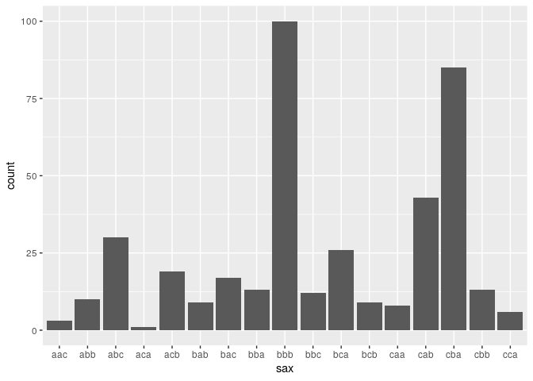
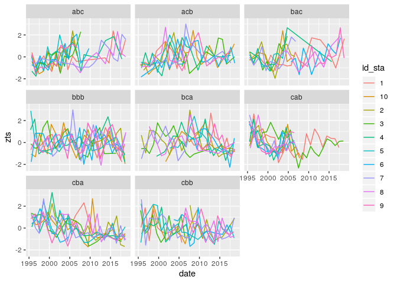

<!-- README.md is generated from README.Rmd. Please edit that file -->
Analyse desassembly and assembly processes in fish communities
==============================================================

<!-- badges: start -->
<!-- badges: end -->
The goal of this project is to analyze the links between the biomass
dynamics and community structure dynamics.

Data  
------

data about communities are located in `data` folder.

``` r
ts_biomass  <- community_metrics %>%
  select(station, date, biomass) %>%
  mutate(station = as.character(station)) %>%
  group_by(station) %>%
  arrange(date) %>%
  nest()

ts_biomass %<>%
  mutate(
    zts = map(data, function(x) znorm(x$biomass, threshold = 0.01)),
    paa = map(zts, ~paa(., 3)),
    sax = map_chr(paa, ~series_to_string(., 3))
  )
```

``` r
pattern_dist <- ts_biomass %>%
  group_by(sax) %>%
  summarise(count = n()) %>%
  arrange(desc(count))
ggplot(ts_biomass, aes(x = sax)) +
  geom_histogram(stat = "count")
#> Warning: Ignoring unknown parameters: binwidth, bins, pad
```



``` r

filter(pattern_dist, count > 10)
#> # A tibble: 10 x 2
#>    sax   count
#>    <chr> <int>
#>  1 bbb     100
#>  2 cba      85
#>  3 cab      43
#>  4 abc      30
#>  5 bca      26
#>  6 acb      19
#>  7 bac      17
#>  8 bba      13
#>  9 cbb      13
#> 10 bbc      12
```

``` r
test <- ts_biomass %>%
  filter(sax %in% c("cba", "bbb", "cab", "abc", "acb", "bca", "bac", "cbb")) %>%
  group_by(sax) %>%
  sample_n(10) %>%
  mutate(
    paa2 = map2(data, zts, function (x, zts) {
      cbind(x[,1], zts)
  }),
    id_sta = as.character(seq(1,n()))

  ) %>%
  unnest(paa2)

ggplot(test, aes(x = date, y = zts)) +
  geom_line(aes(color = id_sta)) +
  facet_wrap(~ sax)
```


